# Sistemas de Gestión Empresarial - Odoo
### Tirso García y Enrique Morán
## INDICE
1. Sitio Web
2. Tablero
3. Gestion de tareas de Dept.Administración     
4. Productos y Servicios
5. Agenda
6. Eventos
7. Contactos
8. Seguridad del sistema
    

## 1. Sitio Web
**Página Principal**

La página web sigue un estilo sencillo y limpio que se enfoca en presentar el producto.

Lo primero que encontramos en la web es una pequeña descripción de nuestra aplicación. A continuación una pequeña descripción sobre las funcionalidades mas importante de esta.
Para terminar una linea que nos muestra como empezar a trabajar con esta aplicacion y los datos sobre nosostros.

La web está hecha con los módulos que nos ofrece odoo (Banner, Columns y Steps) personalizados para nuestra app, la información del pie de la pagina odoo la extrae directamente cuando la hemos creado en la base de datos.

Además a traves de los styles de cada módulo hemos modificado la paleta de colores y otras características.

**Contáctenos**

Simplemente es un apartado en el que se muestran nuestros datos de contacto para que los usuarios ante cualquier duda o consulta puedan hablar con nosotros. Está realizado de la misma manera que la anterior, con módulos (Banner, Text y Features)y sus styles.

**Eventos**

En esta ventana se muestran próximos eventos en la app.

**Tienda**

En esta ventana se encuenta ubicada la tienda donde comprar productos de nuestra app.

## 2. Tablero

El tablero de trabajo es una estructura basada en columnas en las que se va a desarollar el proyecto. Es un método de organización que conecta con flujos el desarrollo en tiempo y responsabilidades de los integrantes de nuestro proyecto, permitiendo saber el estado de nuestra tarea.

En la imagen de abajo tenemos organizado la distribución de nuestro proyecto, quien se encarga de realizarlo , las fechas de trabajo entrega , y ademas a que departamento pertenece ese trabajo en concreto
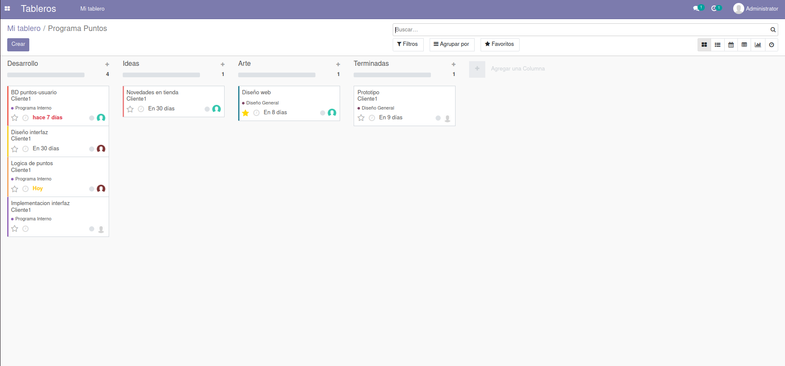

## 3. Gestion de tareas de Dept.Administración

Desde el departamento de administración podemos gestionar las distintas fases de nuestros proyectos pudiendo asignar fechas, empleados, asignación de clientes y el elemento de venta
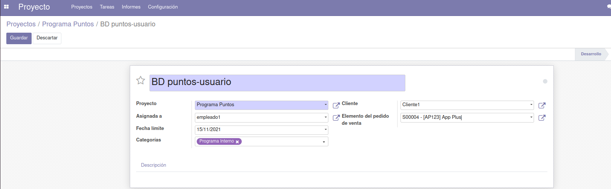
pudiendo comunicarnos con nuestros clientes y ademas con un historial para visualizar los cambios
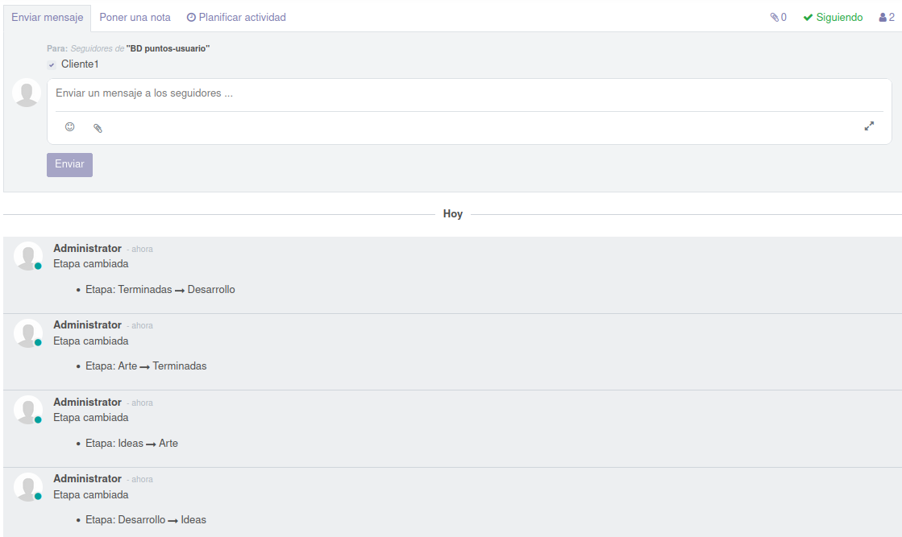

Se reflejará en nuestro tablero de trabajo pudiendo hacer un seguimiento efectivo del proyecto
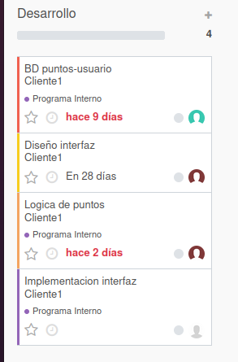

## 4. Productos y Servicios

En esta sección presentamos aplicaciones alternativas a Focus, para que nuestros clientes puedan descargar otras aplicaciones nuevas que nuestra empresa garantiza la satisfacción total de nuestros clientes
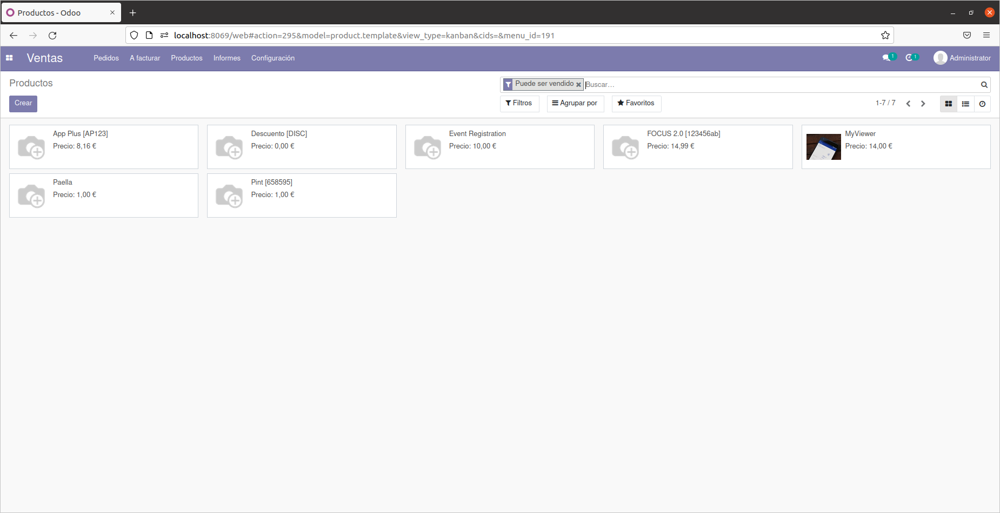

Aqui tenemos  un ejemplo de producto creado, MyViewer una aplicación nueva en nuestra empresa, que podemos ver en nuestra página web. en la seccion de tienda. Odoo nos proporciona una plantilla para poder poner con todo tipo de detalles sus carácteristicas.

Aqui tenemos un producto nuevo en nuestra empresa MyViewer un lector y editor de texto

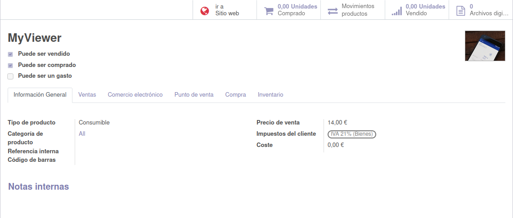

En nuestra web implementamos un carrito
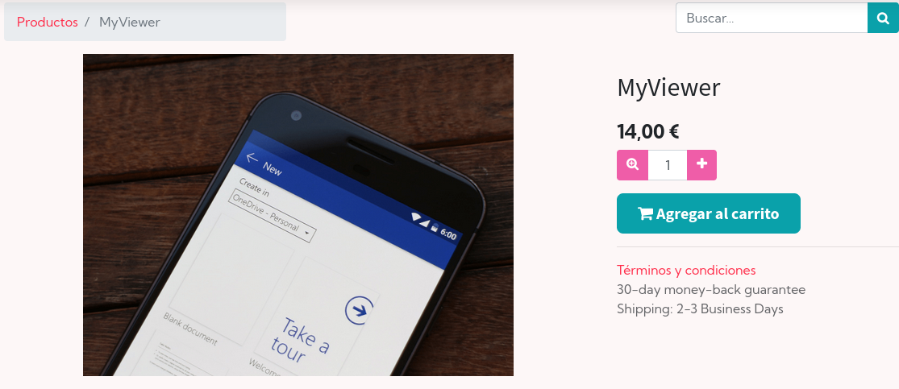

En el que podemos realizar una compra segura
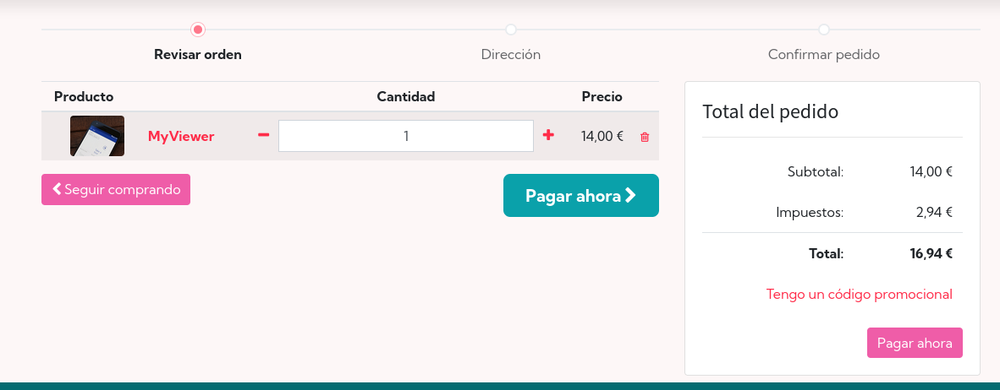
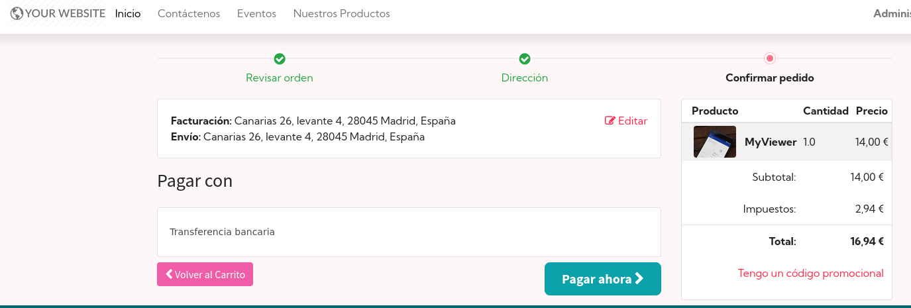
Aqui tenemos la orden de pago que tenemos que gestionar cuando el cliente pague.
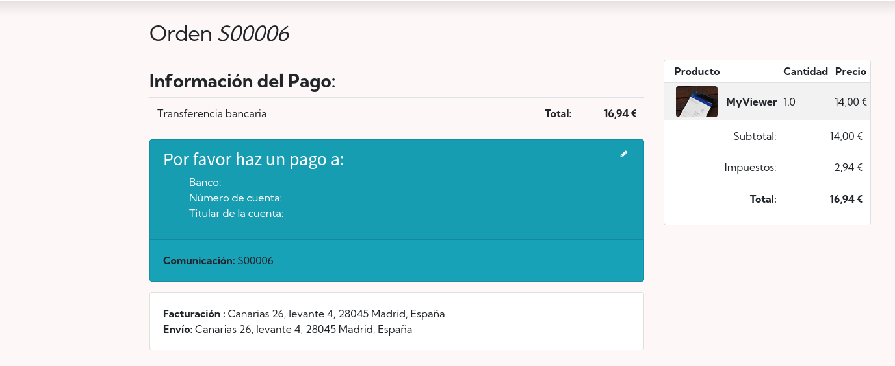

## 5. Agenda
Organiza Eventos, Formación y Webinars

La utilidad de este  modulos es organizar reuniones, conferencias, formación y webinars, Odoo te facilita todas las funcionalidades y características que vas a necesitar para gestionar reuniones , fechas de entrega y organización en el trabajo en general.
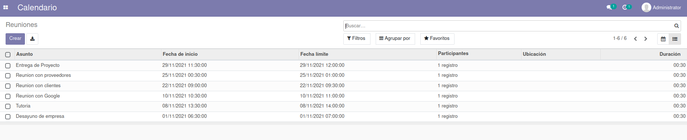

Aqui podemos ver como crear una Reunión con datos a nivel de calendario.
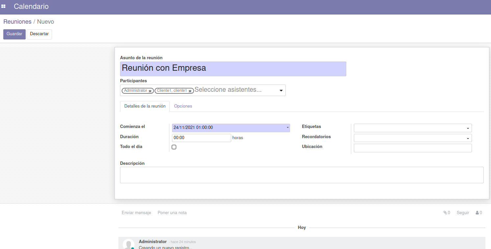

Despúes se nos presentará en nuestro calendario pudiendo tener todos estos eventos de una manera organizada
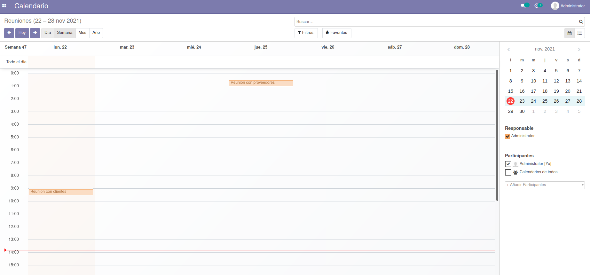

## 6. Eventos

La aplicacion de Eventos nos permite la gestión de distintos eventos que queramos programar para nuestra empresa. Desde la fecha,quienes van, inclusive precios de invitaciones, podemos hacerlo de la manera que queramos
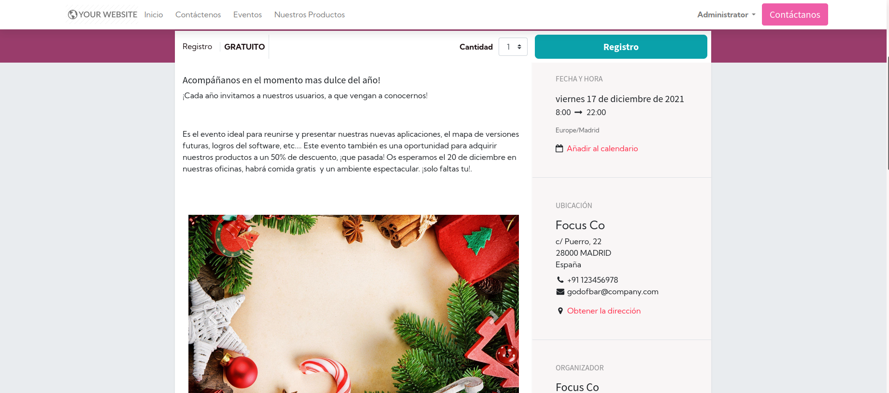

Aqui tenemos un ejemplo
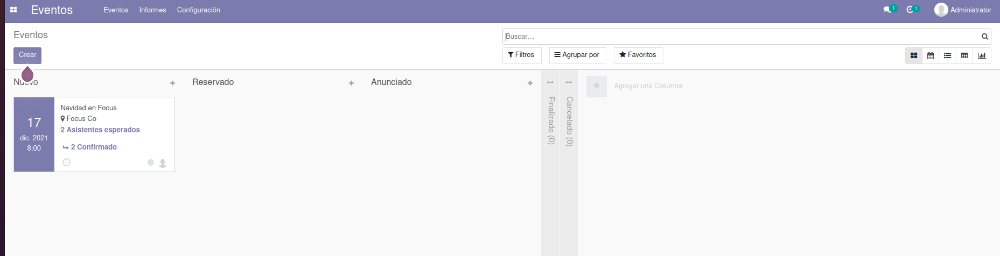
Podemos crear boletos y fijar su precio, en este caso es gratuito.
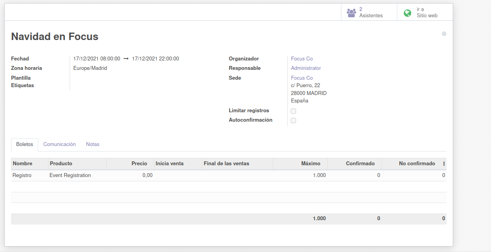
Varios métodos de comunicarnos con nuestros invitados con recordatorios y mensajes de texto
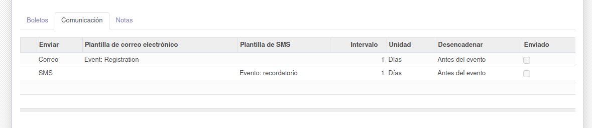
Incluso gestionar a nuestros invitados fijando su presencia o dejandolos en pendiente
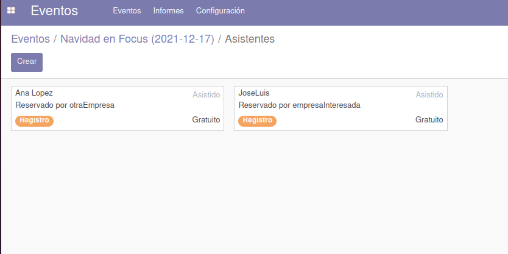

## 7. Contactos

Desde aqui podemos gestionar de una manera rápida y eficiente nuestros clientes y empresas.

aqui creamos a cliente1 en el que con un simple formulario nos permite tener sus datos mas elementales que nos facilitará su futura comunicación,
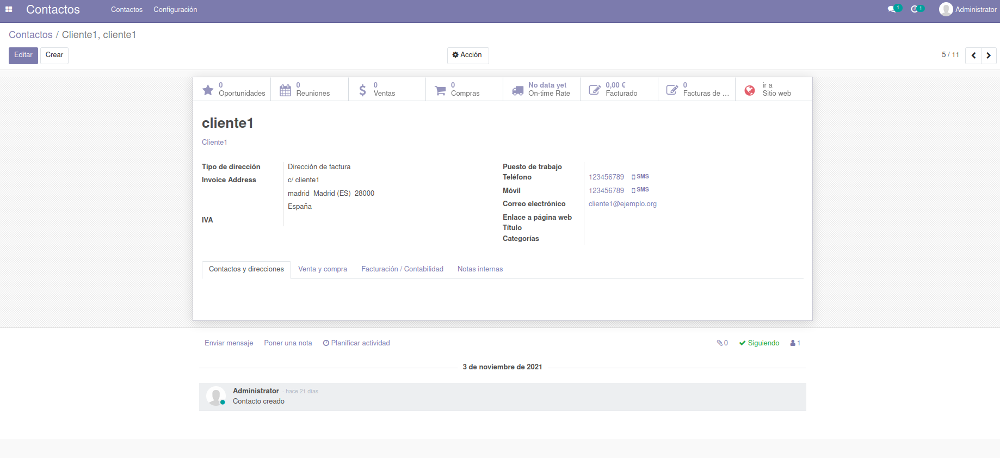

## 8. Seguridad del sistema
Primero se descarga la BDD desde Odoo, para despues encriptarla y guardarla en la carpeta que tengamos destinada para estas copias por si hubiera que recuperarlas por un fallo en la BDD.
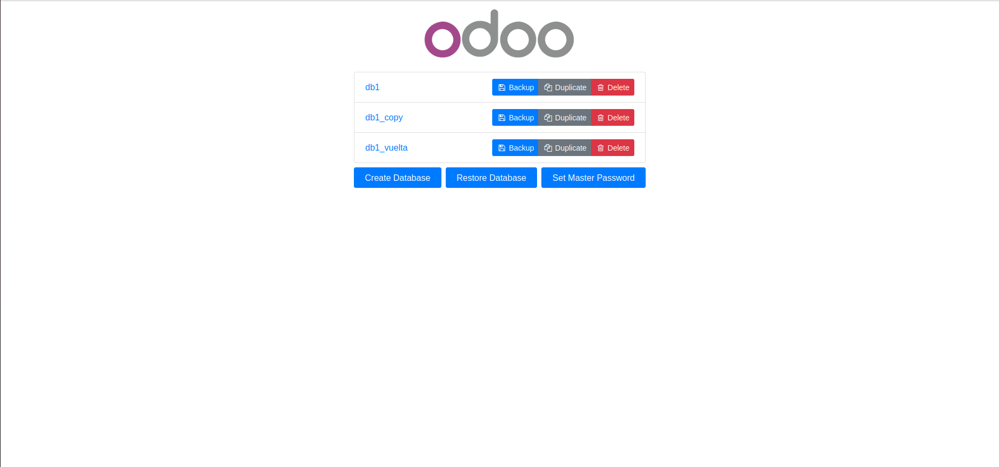
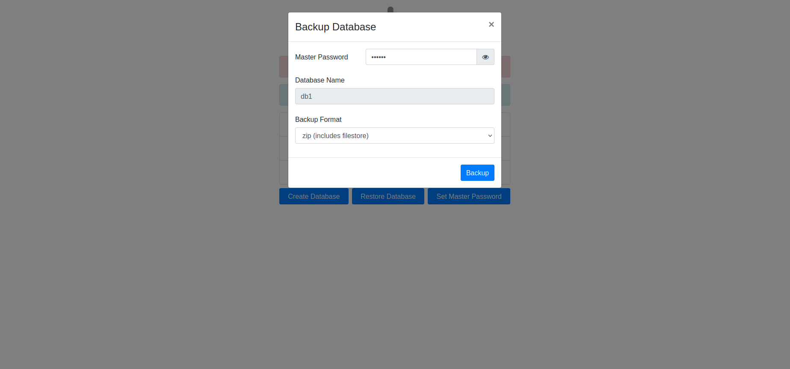
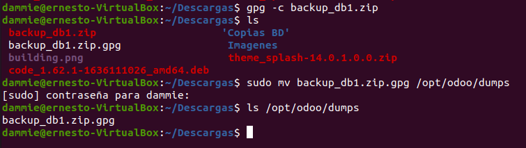
    
